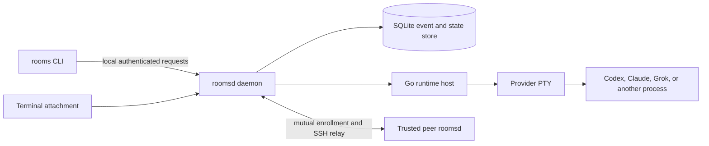

# Wardroom architecture

Rooms separates durable coordination from provider processes and terminal
windows. The daemon owns truth; terminals and agents are clients.



## Durable authority

The TypeScript daemon owns channels, sessions, memberships, messages,
recipients, cursors, lifecycle, credentials, runtime bindings, and queries.
SQLite stores current state and the change journal. A client cannot make itself
an operator by setting a request field; the daemon resolves authority from its
own session state.

## Runtime authority

The cgo-free Go host owns one provider PTY generation. The daemon records the
binding between that runtime generation and a durable Rooms session. Terminals
attach as bounded observers or as one controller with a lease. Provider PIDs,
environment variables, and terminal bytes are runtime details, not session
identity.

Message delivery follows this path:

```text
sender -> rooms CLI -> roomsd -> durable event and recipients
                              -> active runtime binding -> Go host -> provider PTY
```

A delivery receipt proves canonical acceptance and names the runtime recipients
that accepted delivery. It does not prove model attention or action.

## Provider boundary

Rooms keeps the channel/session protocol neutral. Provider profiles decide how
to start or resume Codex, Claude, or Grok. Provider transcript formats and
workflow policy do not enter the core protocol.

There are three intended delivery paths:

1. Live runtime delivery through a Rooms-owned PTY.
2. Headless drivers that resume durable provider conversations.
3. An MCP server for agents that ask Rooms for work.

The live runtime and Codex driver exist. Broader driver coverage and MCP remain
future work.

## Federation boundary

Each machine has an Ed25519 identity and local state authority. Federation uses
mutual enrollment and SSH relay transport. Channels have a home authority;
routes and subscriptions connect trusted machines to that home.

Enrollment authenticates a peer machine but does not grant blanket channel or
runtime access. A channel owner grants and revokes admission for one peer and
one channel, and the home authority rechecks that admission before registration
and data access.

Remote terminal attach requires a capability issued and signed by the runtime's
home authority. The capability is bound to the peer, session, runtime,
generation, allowed actions, and expiry. Rooms burns its nonce in durable state
before attach, so it cannot be replayed. The relay uses a scoped worker actor;
it does not turn an enrolled peer into a local operator.

The responder caps sessions still in the handshake and admits only one
authenticated inbound relay session per peer. Before authentication, rejection
frames use a fixed message and keep local state paths and signing-key errors in
the local log.

## Source and release boundary

A generated source snapshot includes `PUBLIC_EXPORT_MANIFEST.json`, which
binds its exported paths and hashes to one source commit. A source checkpoint
does not by itself claim a signed binary, hosted package, or approved federation
release. Those need their own release evidence.

## Current platform boundary

The TypeScript daemon and CLI run in Linux CI. The Go PTY host has a Darwin
adapter and is macOS-only in v0.1. Linux PTY hosting requires a native adapter
before it can be claimed or distributed.
