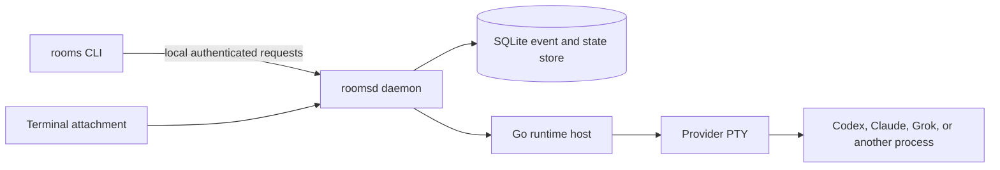

# Wardroom architecture

Wardroom separates durable coordination from provider processes and terminal
windows. The daemon owns truth; terminals and agents are clients.



## Durable authority

The TypeScript daemon owns channels, sessions, memberships, messages,
recipients, cursors, lifecycle, credentials, runtime bindings, and queries.
SQLite stores current state and the change journal. A client cannot make itself
an operator by setting a request field; the daemon resolves authority from its
own session state.

## Runtime authority

The cgo-free Go host owns one provider PTY generation. The daemon records the
binding between that runtime generation and a durable Wardroom session. Terminals
attach as bounded observers or as one controller with a lease. Provider PIDs,
environment variables, and terminal bytes are runtime details, not session
identity.

Message delivery follows this path:

```text
sender -> rooms CLI -> roomsd -> durable event and recipients
                              -> active runtime binding -> Go host -> provider PTY
```

A delivery receipt proves canonical acceptance and names the runtime recipients
that accepted delivery. It does not prove model attention or action.

## Provider boundary

Wardroom keeps the channel/session protocol neutral. Provider profiles decide how
to start or resume Codex, Claude, or Grok. Provider transcript formats and
workflow policy do not enter the core protocol.

There are three intended delivery paths:

1. Live runtime delivery through a Wardroom-owned PTY.
2. Headless drivers that resume durable provider conversations.
3. An MCP server for agents that ask Wardroom for work.

The live runtime and Codex driver exist. Broader driver coverage and MCP remain
future work.

## Public v0.1 boundary

Public v0.1 runs on one machine. Federation and remote terminal attach are
omitted from this export and require a separate security review before a later
release.

## Source and release boundary

A generated source snapshot includes `PUBLIC_EXPORT_MANIFEST.json`, which
binds its exported paths and hashes to one source commit. A source checkpoint
does not by itself claim a hosted package or published release. Those need
their own release evidence.

## Current platform boundary

The TypeScript daemon and CLI run in Linux CI. The Go PTY host has a Darwin
adapter and is macOS-only in v0.1. Linux PTY hosting requires a native adapter
before it can be claimed or distributed.
